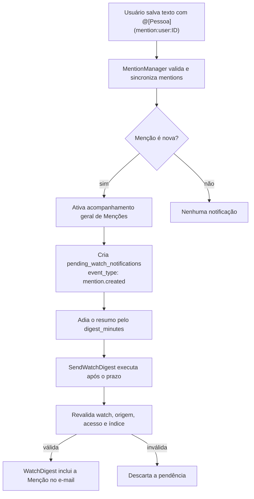

# Fluxo de notificações de Menções

Este documento descreve como uma Menção a Usuário se transforma em uma
notificação agrupada no resumo de acompanhamento por e-mail.

## Visão geral

Uma Menção nova a Usuário não envia um e-mail imediatamente. Ela cria uma
pendência no mesmo mecanismo usado pelos acompanhamentos de Projetos, Tarefas
e Reuniões. O `SendWatchDigest` aguarda o intervalo configurado em
`projetos.watching.digest_minutes` e reúne a Menção com outras atividades do
mesmo destinatário.



## 1. Salvamento e identificação da Menção

Os campos Markdown continuam tendo o Markdown bruto como fonte da verdade e a
tabela `mentions` como índice derivado. O fluxo passa por
[`MentionManager`](../../../app/Services/Mentions/MentionManager.php):

1. O parser extrai referências explícitas com a sintaxe
   `@[Rótulo histórico](mention:user:ID)`.
2. Menções novas são validadas conforme a elegibilidade do contexto.
3. A relação é criada em `mentions` dentro da transação de sincronização.
4. Somente relações novas com `target_type = user` continuam para a
   notificação.

Para decidir se a Menção é nova, o sistema compara as referências do texto
salvo para fins de validação e o índice anterior para fins de notificação. Essa
distinção é necessária porque, em uma atualização, o texto já foi persistido
quando a sincronização é chamada.

O comando `mentions:rebuild` recupera o índice, mas não cria notificações nem
ativa acompanhamentos.

## 2. Acompanhamento geral de Menções

Foi reutilizada a tabela `watches` com dois tipos técnicos especiais:

| Situação            | `watchable_type`   | `watchable_id` |
| ------------------- | ------------------ | -------------- |
| Menções ativas      | `mention`          | ID do usuário  |
| Menções desativadas | `mention_disabled` | ID do usuário  |

Exemplo:

```text
user_id: 42
watchable_type: mention
watchable_id: 42
```

Esse registro representa “o usuário 42 recebe notificações de Menções”.

O `WatchController` trata `mention` separadamente, antes de tentar resolver um recurso polimórfico como Projeto ou Tarefa. A dashboard também filtra os tipos `mention` e `mention_disabled` para que eles não apareçam nos cards de recursos.

Ao desativar:

1. remove o registro `mention`;
2. cria `mention_disabled`;
3. remove pendências de Menção.

Quando uma nova Menção ocorre, o sistema só recria `mention` se não existir `mention_disabled`. Assim o opt-out permanece salvo sem criar uma tabela de preferências.

## 3. Criação da pendência

Depois de ativar o acompanhamento, o sistema localiza o Usuário mencionado e
monta a apresentação da origem com `MentionBacklinks`. A origem pode ser um
Projeto, Tarefa, Reunião, Item de pauta ou Comentário, desde que continue
visível ao destinatário.

Uma linha é criada em `pending_watch_notifications` com estes valores:

| Campo            | Valor                                       |
| ---------------- | ------------------------------------------- |
| `event_type`     | `mention.created`                           |
| `watchable_type` | `mention`                                   |
| `watchable_id`   | ID da relação em `mentions`                 |
| `user_id`        | Usuário mencionado                          |
| `actor_id`       | Usuário que criou a Menção                  |
| `title`          | Rótulo da origem, como o nome do Projeto    |
| `summary`        | Texto indicando que a pessoa foi mencionada |
| `details`        | Trecho do campo textual                     |
| `url`            | Link autorizado para a origem               |
| `send_after`     | Momento atual + `digest_minutes`            |

Todas as pendências do destinatário recebem um novo `send_after`. Uma
atividade posterior reinicia a janela de digestão e pode agrupar Menções com
comentários ou alterações de recursos.

O autor da ação não recebe a própria Menção.

## 4. Processamento do resumo

Quando o job [`SendWatchDigest`](../../../app/Jobs/SendWatchDigest.php) é
executado, ele:

1. confirma que a pendência processada ainda é o registro mais recente do
   destinatário;
2. carrega todas as pendências desse destinatário em ordem de ocorrência;
3. carrega a relação `Mention` para pendências `mention.created`, sem tentar
   resolver `mention` como um `Watchable`;
4. confirma que o acompanhamento geral continua ativo;
5. consulta `MentionManager::incomingMentions` para confirmar que a origem e o
   destino ainda são autorizados e que a relação ainda existe;
6. envia um único [`WatchDigest`](../../../app/Mail/WatchDigest.php) quando
   houver pelo menos uma atividade válida;
7. remove as pendências processadas, inclusive as descartadas por invalidez.

A Menção não concede acesso à origem. Se o destinatário perder acesso antes do
envio, a pendência é descartada sem revelar o conteúdo no e-mail.

## 5. Ativar e desativar na dashboard

O card geral usa as mesmas rotas de acompanhamento dos recursos:

- `PUT /watches/mention/{userId}` ativa o acompanhamento;
- `DELETE /watches/mention/{userId}` desativa o acompanhamento.

O `WatchController` trata `mention` antes de tentar resolver um recurso
polimórfico. A operação só pode ser feita pelo próprio usuário cujo ID aparece
na rota.

Ao desativar:

1. o registro ativo `mention` é removido;
2. o marcador `mention_disabled` é gravado para preservar o opt-out sem uma
   nova tabela;
3. pendências `mention.created` do usuário são removidas;
4. pendências restantes de outros tipos são reagendadas pelo intervalo do
   digest.

Ao ativar manualmente, o marcador de opt-out é removido e o registro `mention`
é criado novamente. Uma Menção futura ativa automaticamente o acompanhamento
somente quando não houver esse opt-out.

## 6. Regras de manutenção

- Não crie notificações ao reconstruir `mentions`.
- Não use `watchable()` para resolver pendências cujo tipo seja `mention`.
- Não envie uma Menção sem revalidar acesso no momento do digest.
- Não transforme a Menção em concessão de acesso.
- Para adicionar outro acompanhamento geral, reutilize o card e defina um tipo
  próprio em vez de misturá-lo aos tipos de recursos acompanháveis.
- Mantenha `mention.created` no enum
  [`WatchEventType`](../../../app/Enums/Watch/WatchEventType.php) para preservar
  o contrato do resumo e permitir filtros futuros.
