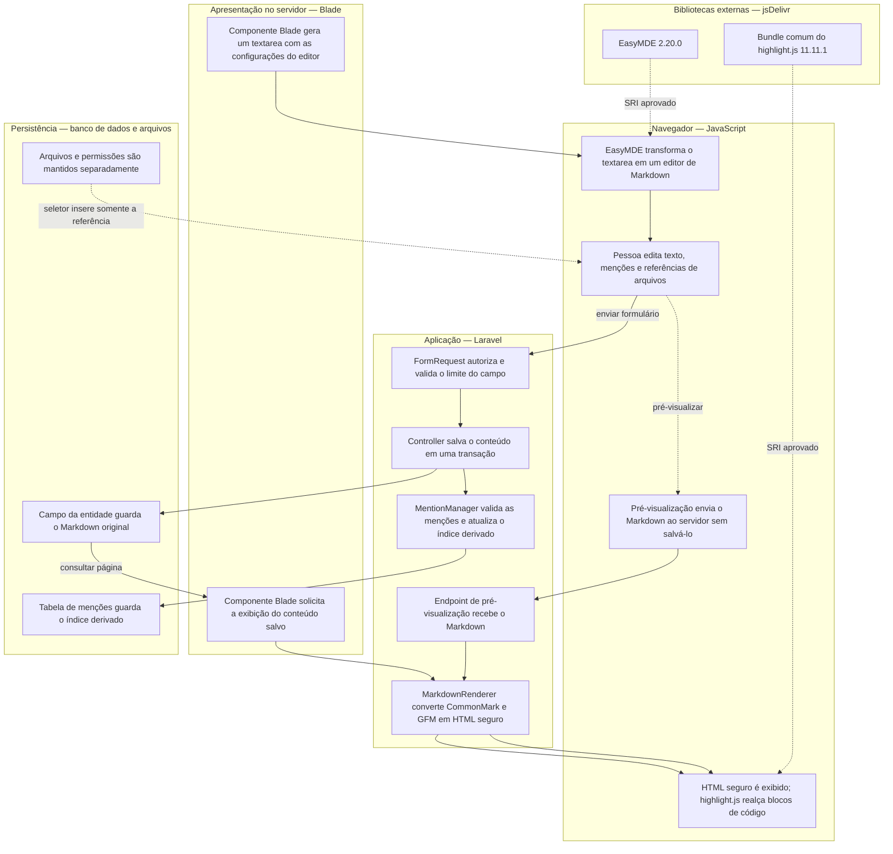

# Fluxo de Markdown

O Markdown atravessa as camadas abaixo desde a edição até a exibição. O texto
original permanece como fonte de verdade; o HTML é uma representação derivada.

## Responsabilidade de cada camada

- **Blade:** disponibiliza o `textarea` e solicita a renderização do conteúdo salvo.
- **Navegador:** carrega EasyMDE e `highlight.js` globalmente pelo jsDelivr; o
  EasyMDE melhora a edição, a pré-visualização envia Markdown e o
  `highlight.js` atua apenas no realce de código já convertido em HTML. Se o
  CDN falhar, o `textarea` e o conteúdo sem realce permanecem utilizáveis.
- **Laravel:** valida a entrada, grava o Markdown original, atualiza o índice de
  menções e usa o `MarkdownRenderer` na pré-visualização e na exibição final.
- **Persistência:** o campo da entidade guarda o Markdown; menções são um índice
  derivado; arquivos e permissões ficam sob responsabilidade do módulo de arquivos.

O `MarkdownRenderer` escapa HTML escrito pelo usuário, aceita links relativos e
links `http` ou `https`, abre links em nova aba e impede protocolos inseguros.
Imagens em Markdown são convertidas em links seguros, não incorporadas à página.
