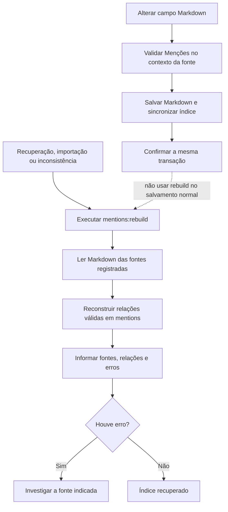

# Operação: índice de Menções e auditoria

Este procedimento cobre dois dados de suporte que exigem atenção operacional:
o índice derivado de Menções e a retenção do log de auditoria. Execute os
comandos na raiz do projeto, com a mesma configuração de ambiente da aplicação.

## Reconstruir o índice de Menções

O Markdown é a fonte editorial da verdade. A tabela `mentions` é reconstruível
e não deve ser corrigida manualmente no banco. Use a reconstrução após uma
recuperação de banco, importação de conteúdo, reparo de uma inconsistência ou
uma migração que tenha afetado fontes de Menções.

```sh
php artisan mentions:rebuild
```

O comando percorre todas as fontes Markdown registradas — Projetos, Tarefas,
Reuniões, Itens de pauta e Comentários ativos —, reconstitui as relações para
Usuários, Projetos, Tarefas, Reuniões e Arquivos e informa no final a quantidade
de fontes, relações e erros. A operação é idempotente: repetir o comando não
cria relações duplicadas. Destinos excluídos logicamente permanecem no índice
para uma possível restauração; destinos definitivamente ausentes são ignorados
e suas relações removidas. Ele termina com falha se encontrar erro; trate esse
resultado como sinal para investigar a fonte apontada antes de repetir a
execução. Caso a tabela ainda não exista, as migrações precisam ser aplicadas
antes do comando.

Não use a reconstrução como fluxo normal de salvamento. As alterações rotineiras
devem validar e sincronizar o índice na mesma transação que grava o Markdown.

Para consultas internas, use as operações autorizadas do `MentionManager` nas
duas direções. `outgoingMentions()` e `incomingMentions()` dos Models são
relacionamentos do índice bruto e não devem ser apresentados diretamente a um
leitor: a consulta autorizada reavalia a visibilidade da fonte e do destino.

O caminho normal e o caminho de recuperação têm responsabilidades diferentes:



## Limpar a auditoria

O agendador executa diariamente às 02:00:

```sh
php artisan app:clean-activity-log
```

As políticas de retenção ficam em `config/projetos.php`, na chave
`activitylog.retention_policies`; atualmente, os logs configurados têm 365 dias
de retenção. Nomes de log sem política específica usam o prazo de fallback da
configuração. O agendador também mantém a limpeza semanal de fallback fornecida
pela biblioteca de auditoria.

Antes de alterar retenção ou executar uma limpeza manual, faça uma simulação:

```sh
php artisan app:clean-activity-log --dry-run
```

O modo `--dry-run` lista quantos registros seriam removidos e não altera dados.
Sem essa opção, a remoção é definitiva. Planeje backup e a revisão da política
de retenção antes de executar manualmente em produção.

## Fila e observabilidade

E-mails imediatos e resumos de acompanhamento dependem da fila. Miniaturas são
geradas durante o próprio envio do Arquivo e não dependem do worker. Na
configuração padrão, inicie um worker compatível com a fila `database`:

```sh
php artisan queue:work database --queue=default --sleep=3 --tries=4 --timeout=60
```

O resumo de acompanhamento é despachado após a confirmação da transação e fica
atrasado pelo intervalo configurado em `projetos.watching.digest_minutes`
(cinco minutos por padrão).
