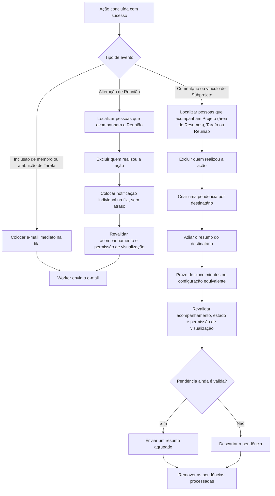

# Notificações por e-mail

Esta página descreve os e-mails enviados pela aplicação, seus destinatários e
como cada envio é processado.

## Quando cada e-mail é enviado

| Evento | Destinatário | Tipo de envio | Quando é enviado |
| --- | --- | --- | --- |
| Inclusão de membro em um Projeto | Pessoa incluída no Projeto | Imediato, pela fila | Após a inclusão ser concluída. Não é enviado se a própria pessoa realizou a inclusão. |
| Atribuição de responsável a uma Tarefa | Pessoa atribuída à Tarefa | Imediato, pela fila | Após a atribuição ser concluída. Não é enviado se a pessoa já estava atribuída ou se realizou a própria atribuição. |
| Criação de Comentário em Projeto, Tarefa ou Reunião acompanhada | Pessoas que acompanham o recurso | Resumo agrupado, pela fila | Entra no resumo como `Novo comentário.`, com o texto do Comentário. |
| Menção nova a uma pessoa | Pessoa mencionada, quando o acompanhamento geral de Menções está ativo | Resumo agrupado, pela fila | Entra no mesmo resumo com a origem da Menção e um link para o texto. |
| Agendamento ou atualização de Reunião acompanhada | Pessoas que acompanham a Reunião | Imediato, pela fila | Envia `Reunião agendada.` ou `Reunião atualizada.` sem aguardar nem alterar o resumo. Reuniões em rascunho não geram essa notificação. |
| Remoção de Reunião acompanhada | Pessoas que acompanham a Reunião | Resumo agrupado, pela fila | Entra no resumo como `Reunião removida.`. Não contém link para a Reunião removida. Reuniões em rascunho não geram essa notificação. |
| Vínculo de Subprojeto acompanhado | Pessoas que acompanham o Subprojeto | Resumo agrupado, pela fila | Entra no resumo informando o Projeto pai. |
| Desvínculo de Subprojeto acompanhado | Pessoas que acompanham o Subprojeto | Resumo agrupado, pela fila | Entra no resumo informando o Projeto organizacional anterior. |

Em todos os eventos de acompanhamento, a pessoa que executou a ação não recebe
notificação sobre a própria ação.

## Envio imediato pela fila

Os e-mails de inclusão de membro, atribuição de Tarefa e alteração de Reunião
são colocados na fila. O worker da fila executa o envio assim que processar o
trabalho; portanto, eles não aguardam a formação de um resumo. Antes de enviar
uma alteração de Reunião, a aplicação confirma que a pessoa ainda a acompanha
e ainda pode visualizá-la.

## Resumo de acompanhamentos

O resumo é destinado a pessoas que ativaram o acompanhamento do Projeto,
da Tarefa, da Reunião relacionada ou de Menções gerais. As pessoas diretamente vinculadas aos
Projetos de uma nova Reunião começam com esse acompanhamento ativo e podem
desativá-lo na própria página. Ele é um resumo por destinatário, e não por
recurso: atividades em diferentes recursos acompanhados podem compor o mesmo
e-mail. Alterações de Reunião são a exceção: são enviadas imediatamente e não
entram no resumo.

Cada nova atividade adia o envio de todas as pendências daquele destinatário.
O intervalo padrão é de cinco minutos, configurado em
`projetos.watching.digest_minutes`. Quando esse prazo vence, o trabalho
`SendWatchDigest` é executado pela fila e envia um único e-mail com as
atividades ainda válidas.

Antes do envio, a aplicação confirma que a pessoa ainda acompanha cada recurso
e ainda pode visualizá-lo. Tarefas concluídas e Reuniões concluídas também são
descartadas e não aparecem no resumo.

## Consultar e gerenciar acompanhamentos

A seção **Acompanhamentos** da dashboard pessoal lista os Projetos, as Tarefas
e as Reuniões que a pessoa acompanha. Cada item oferece um link direto para o
recurso e um botão para deixar de acompanhá-lo. Recursos que a pessoa não pode
mais visualizar não são exibidos. Ao concluir uma Tarefa ou Reunião, ela deixa
de aparecer nessa seção e deixa de gerar notificações. Se o recurso for
reaberto, o acompanhamento volta a valer.

O card **Preferências gerais** fica ao lado dos cards de recursos e permite
ativar ou desativar o recebimento de Menções. Uma Menção nova ativa esse
acompanhamento para a pessoa mencionada; desativá-lo remove as pendências de
Menção já acumuladas e mantém a escolha para as próximas Menções.

Deixar de acompanhar um item desativa suas notificações e remove as atividades
pendentes relacionadas a ele. Essa ação não altera membros, responsáveis nem as
permissões do recurso.

O processamento separa os envios imediatos dos eventos agrupados em resumo:

