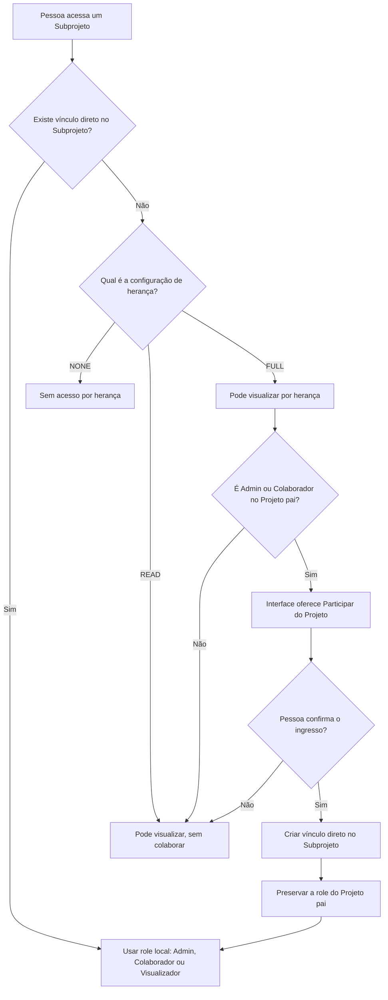

## 1. Níveis de permissão por projeto

> O acesso aos projetos é baseado na role do usuário dentro da tabela pivô `project_user`, com três níveis ativos no MVP.

* **Admin:** pode gerenciar membros, excluir projetos e executar todas as ações de colaborador dentro do projeto.
* **Colaborador:** pode criar e editar tarefas, reuniões e dados do projeto, além de comentar nos recursos associados.
* **Visualizador:** pode visualizar projetos e entidades relacionadas, mas não pode criar nem editar conteúdo.

#### 1.1 Roles válidas são `ADMIN`, `CONTRIBUTOR` e `VIEWER`, mapeadas para labels de UI (Admin, Colaborador, Visualizador).

---

## 2. Escopo global (role admin)

> Existe um nível global de acesso baseado em roles/permissões do sistema (Spatie Permission), independente da role do projeto.

* **Quem possui:** usuários com role `admin` ou permissão `admin` no sistema.
* **Rotas protegidas:** a área administrativa usa middleware `can:admin`.

---

## 3. Gestão de membros e roles

> A administração de membros é centralizada no módulo de configurações do projeto e restrita a admins do projeto.

* **Adicionar membros:** apenas admins do projeto podem incluir usuários e definir a role inicial.
* **Remover membros:** apenas admins do projeto podem remover; o último admin do projeto não pode ser removido.
* **Alterar role:** apenas admins do projeto; não é possível rebaixar o último admin do projeto.
* **Criação de projeto:** o usuário criador entra automaticamente como `ADMIN` no projeto.

---

## 4. Projetos

> As permissões de projeto determinam acesso à visualização, edição e configurações gerais.

* **Visualizar:** requer ser visualizador do projeto, incluindo herança para subprojetos quando configurada.
* **Criar:** permitido apenas para usuários em `senhaunica.estagiario`, `senhaunica.docente` ou `senhaunica.servidor`.
* **Editar configurações:** somente `ADMIN` do projeto pode atualizar nome, slug, descrição, status, tags, visibilidade, herança de permissões e módulos.
* **Excluir:** somente `ADMIN` do projeto pode deletar projetos.

---

## 5. Tarefas (Tasks)

> O módulo de tarefas é controlado por policy e pela habilitação do módulo no projeto.

* **Visualizar e listar:** requer projeto com módulo `tasks` ativo e usuário com acesso de visualização ao projeto.
* **Criar:** requer `CONTRIBUTOR` no projeto e módulo `tasks` ativo.
* **Editar:** permitido para `ADMIN` do projeto ou usuário atribuído na tarefa, desde que a tarefa não esteja bloqueada.
* **Excluir:** permitido para `ADMIN` do projeto ou criador da tarefa, desde que a tarefa não esteja bloqueada.
* **Atribuir responsáveis:** permitido para `ADMIN` do projeto ou criador da tarefa; o usuário atribuído deve ser colaborador do projeto.

---

## 6. Reuniões (Meetings)

> O módulo de reuniões depende de ativação por projeto e valida regras adicionais para vínculos entre projetos.

* **Visualizar:** requer módulo `meetings` ativo e permissão de visualização no projeto da rota (ou no projeto pai quando o alvo é subprojeto).
* **Criar/editar/excluir:** requer `CONTRIBUTOR` no projeto e módulo `meetings` ativo.
* **Projetos vinculados:** uma reunião pode estar ligada a vários projetos, e todos precisam ter o módulo de reuniões habilitado.
* **Itens de pauta:** somente colaboradores podem adicionar/remover itens, e isso é bloqueado quando a reunião está `COMPLETED`.
* **Notas de itens:** só podem ser atualizadas por colaboradores enquanto a reunião não estiver concluída.

---

## 7. Comentários

> Comentários seguem a permissão do recurso comentado (projeto, tarefa ou reunião).

* **Criar:** requer permissão `comment` no recurso comentado.
* **Visualizar:** depende de permissão `view` no recurso comentado.
* **Editar:** apenas o autor.
* **Remover:** apenas o autor.

---

## 8. Subprojetos

> Subprojetos são projetos independentes vinculados a um projeto organizacional
> por uma relação pai e filho. O vínculo organiza projetos relacionados sem
> fundir seus membros, tarefas, reuniões, módulos ou configurações.

* **Vínculo permitido:** apenas projetos organizacionais podem ter subprojetos; o subprojeto precisa ser projeto raiz e não pode ter subprojetos.
* **Restrições de tipo:** projetos organizacionais não podem ser subprojetos de outros projetos organizacionais.
* **Admin em comum:** o vínculo só é permitido se houver pelo menos um admin em comum entre pai e subprojeto.
* **Quem pode vincular/desvincular:** vincular exige `ADMIN` do projeto pai e permissão de update no subprojeto; desvincular exige `ADMIN` do projeto pai ou `ADMIN` do subprojeto.

---

## 9. Herança de permissões em subprojetos

> A herança controla o acesso de membros do projeto pai que ainda não possuem
> vínculo direto com o subprojeto. Ela não copia automaticamente os membros para
> a tabela `project_user` do filho e não transforma o usuário em participante
> ativo sem uma ação explícita.

* **Precedência da role local:** se o usuário já é membro do subprojeto, sua role
  local (`ADMIN`, `CONTRIBUTOR` ou `VIEWER`) prevalece e a herança deixa de ser
  consultada.
* **`NONE` (Sem Herança):** membros do projeto pai não recebem acesso ao
  subprojeto por herança.
* **`READ` (Apenas Leitura):** membros que podem visualizar o projeto pai também
  podem visualizar o subprojeto, mas não podem ingressar nele por meio do fluxo
  de herança nem executar ações de colaboração.
* **`FULL` (Herança Total):** permite a visualização herdada. Se o usuário possui
  uma role explícita de `ADMIN` ou `CONTRIBUTOR` no projeto pai, a interface
  oferece a ação **Participar do Projeto**.
* **Ingresso voluntário:** ao confirmar a participação, o sistema cria um vínculo
  explícito em `project_user` no subprojeto, preservando a role que o usuário
  possui diretamente no projeto pai. A partir desse momento ele passa a ser um
  membro ativo do subprojeto.
* **Admins do projeto pai:** quando um `ADMIN` do pai ingressa ou já possui
  vínculo local no subprojeto, sua role local deve permanecer `ADMIN`; a
  interface impede seu rebaixamento para `CONTRIBUTOR` ou `VIEWER`.
* **Configuração atual da interface:** o domínio suporta `NONE`, `READ` e `FULL`,
  mas o seletor presente nas configurações do subprojeto atualmente expõe apenas
  `FULL`. Novos projetos também recebem `FULL` como valor padrão.

### Por que o ingresso não é automático

O usuário deve entrar ativamente apenas nos subprojetos com os quais pretende
interagir. Essa decisão evita os seguintes efeitos:

1. **Notificações em massa (spam):** os destinatários de comentários e reuniões
   são obtidos dos membros diretamente vinculados aos projetos. A associação
   automática faria usuários do projeto pai receberem e-mails sobre subprojetos
   nos quais não atuam.
2. **Painéis de projetos poluídos:** “Meus Projetos”, projetos fixados e outras
   consultas pessoais usam os vínculos diretos do usuário. Materializar toda a
   herança faria projetos sem interesse imediato aparecerem nesses painéis.
3. **Membros fantasmas:** sem ingresso voluntário, a equipe do subprojeto poderia
   interpretar usuários herdados como participantes ativos e tentar atribuir
   tarefas a pessoas que não acompanham aquele trabalho. Atualmente, somente
   colaboradores vinculados diretamente ao subprojeto podem ser selecionados
   como responsáveis.
4. **Consultas mais simples e previsíveis:** dashboards, projetos pessoais,
   tarefas atribuídas e parte das consultas de reuniões podem usar relações
   diretas por `user_id`, sem precisar expandir recursivamente todos os projetos
   filhos acessíveis por herança.

Enquanto não ingressa, o usuário conserva apenas o acesso de visualização
permitido pela configuração de herança. Ele não aparece como membro local, não
pode ser atribuído a tarefas do subprojeto e não recebe automaticamente as
notificações destinadas aos participantes desse projeto.

O resultado da herança pode ser resumido assim:

