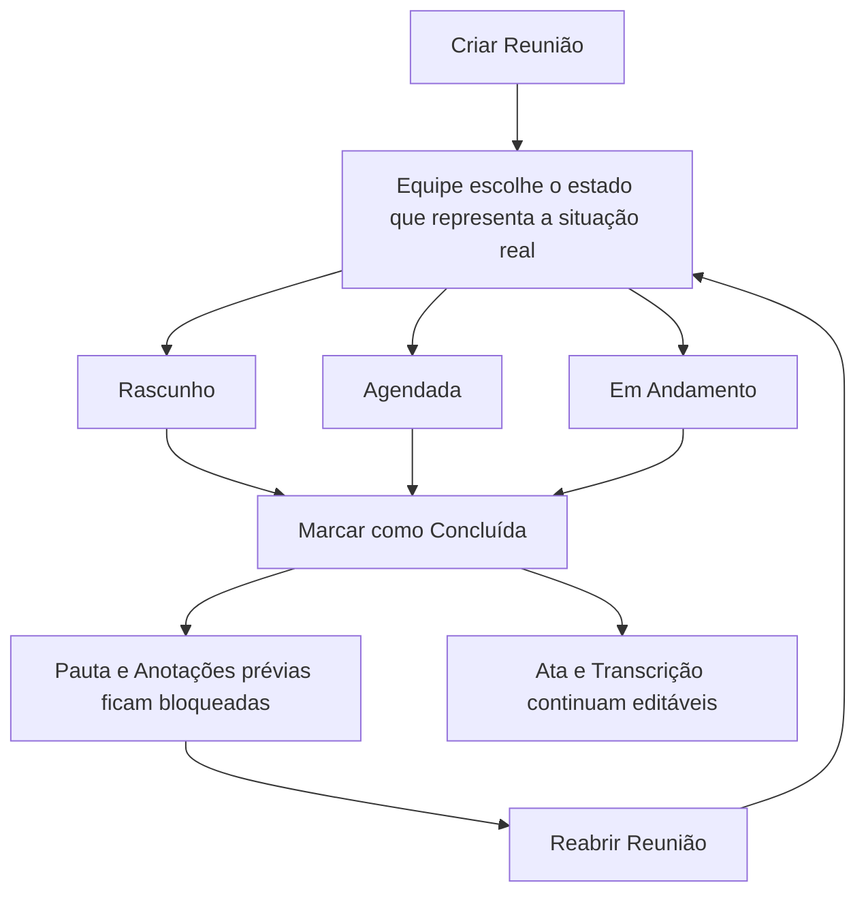

# Reuniões: preparação, pauta e registro

Uma Reunião reúne pessoas e informações de um ou mais Projetos que têm o
módulo de reuniões ativo. Ela organiza o que será discutido, registra o que foi
concluído e mantém esses papéis separados para que a preparação não seja
confundida com o resultado da conversa.

## Criar e vincular Projetos

Para criar uma Reunião, é preciso ser Colaborador ou Admin no Projeto em que o
fluxo foi iniciado e o módulo de reuniões deve estar ativo. A Reunião sempre
fica vinculada a pelo menos um Projeto; o Projeto de origem é mantido no vínculo
mesmo que outros sejam selecionados.

Uma mesma Reunião pode ser vinculada a mais de um Projeto. Todos os Projetos
selecionados precisam ter o módulo de reuniões ativo. Isso permite preparar uma
conversa comum sem duplicar a Reunião em cada contexto.

## Estados da Reunião

As Reuniões usam os estados **Rascunho**, **Agendada**, **Em Andamento** e
**Concluída**. A criação começa como Rascunho. A aplicação não obriga uma ordem
de transição entre os estados; a equipe deve escolher o estado que representa a
situação real.

O estado Concluída protege o conteúdo preparatório: não é possível criar,
remover ou editar itens de pauta, seus títulos independentes ou suas Anotações
prévias. Se a Reunião for reaberta, essas edições voltam a ser permitidas.

Ata e Transcrição continuam editáveis após a conclusão, pois podem ser
finalizadas ou revisadas depois da conversa.

O sistema não obriga uma sequência entre Rascunho, Agendada e Em Andamento. O
fluxo abaixo destaca apenas o efeito de concluir e reabrir a Reunião:

## Pauta

A Pauta é uma lista ordenada de assuntos. Cada item tem exatamente uma das
seguintes formas:

- um Projeto vinculado à Reunião, inclusive um subprojeto desse Projeto;
- uma Tarefa pertencente a um Projeto vinculado;
- um **Item independente**, com título próprio.

O mesmo Projeto ou a mesma Tarefa não pode ser inserido duas vezes na mesma
Pauta. Um Item independente deve ter entre 3 e 255 caracteres depois da
remoção de espaços nas extremidades. Ele não é convertido nem associado
automaticamente a um Projeto ou Tarefa mais tarde.

Cada item pode ter **Anotações prévias do item** em Markdown. Itens de pauta
não possuem Comentários próprios; use os Comentários da Reunião, do Projeto ou
da Tarefa quando esse tipo de discussão for necessário.

## Três registros diferentes

| Registro | Finalidade | Formato | Limite | Bloqueio na conclusão |
| --- | --- | --- | ---: | --- |
| Anotações prévias | Preparar a Reunião como um todo | Markdown | 10.000 caracteres | Sim |
| Anotações prévias do item | Preparar um assunto específico da Pauta | Markdown | 10.000 caracteres | Sim |
| Ata | Sintetizar assuntos relevantes e conclusões | Texto simples | 10.000 caracteres | Não |
| Transcrição | Guardar o texto bruto fornecido por ferramenta externa | Texto simples | 100.000 caracteres | Não |

Anotações prévias e Ata não são sinônimos: a primeira orienta a conversa; a
segunda é o registro final. A Transcrição não é resumida nem transformada em
Ata pela aplicação. Campos deixados vazios são tratados como sem conteúdo.

As Anotações prévias podem usar o [guia de Markdown](markdown/README.md),
inclusive Menções. Ata e Transcrição preservam quebras de linha, mas não
interpretam Markdown ou HTML.

## Comentários, Arquivos e exportação

Pessoas com acesso de contribuição à Reunião podem comentar nela. O
acompanhamento por e-mail é opcional e segue as regras de
[Notificações por e-mail](email/notificacoes.md).

Arquivos enviados diretamente pertencem à Reunião. Também é possível
compartilhar Arquivos específicos de Projetos e Tarefas relacionados à Pauta,
sem mudar o proprietário do Arquivo. Consulte o [guia de Arquivos](arquivos.md)
para entender quem ganha acesso e como revogar o compartilhamento.

A exportação gera um arquivo TXT com título, Pauta, Anotações prévias gerais e
Comentários ativos. Ela não inclui Ata, Transcrição, Arquivos ou
compartilhamentos de Arquivos.

## Quem pode fazer o quê

Visualizadores podem consultar uma Reunião em um Projeto a que tenham acesso.
Colaboradores e Admins do contexto podem criar, editar e remover Reuniões,
desde que o módulo esteja ativo. As regras detalhadas, inclusive o acesso por
herança de subprojetos, estão em [Permissões](permissoes.md).
